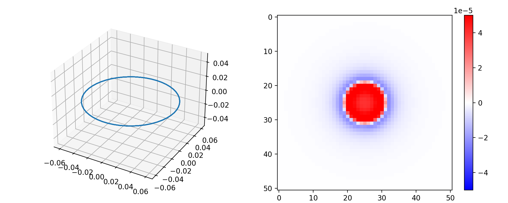
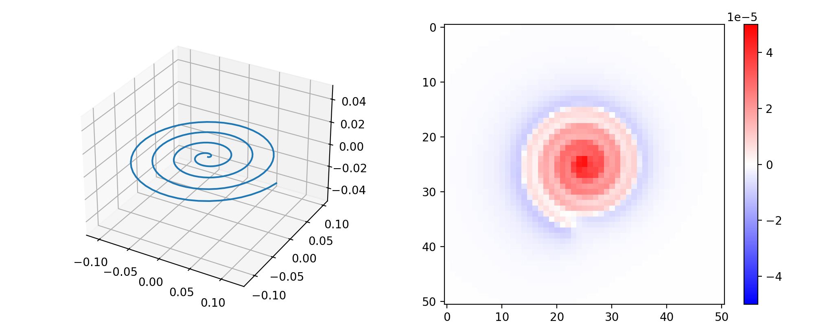
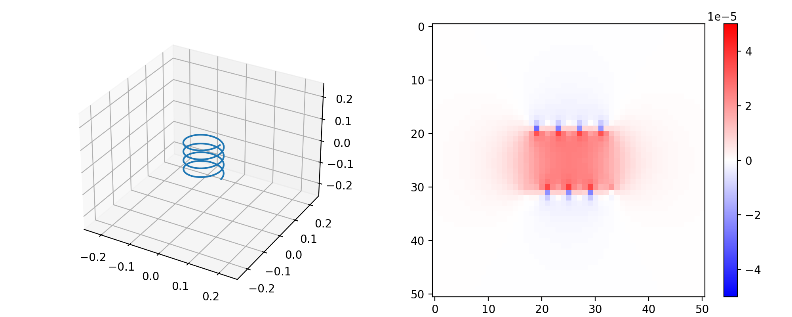
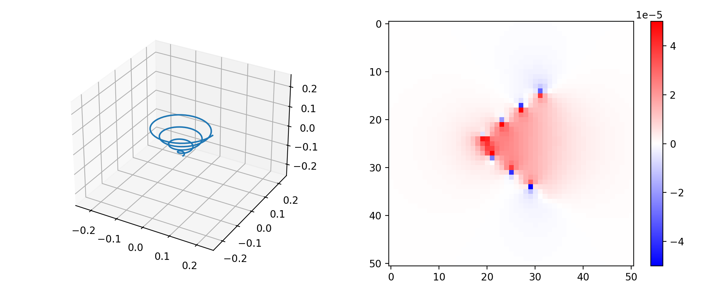
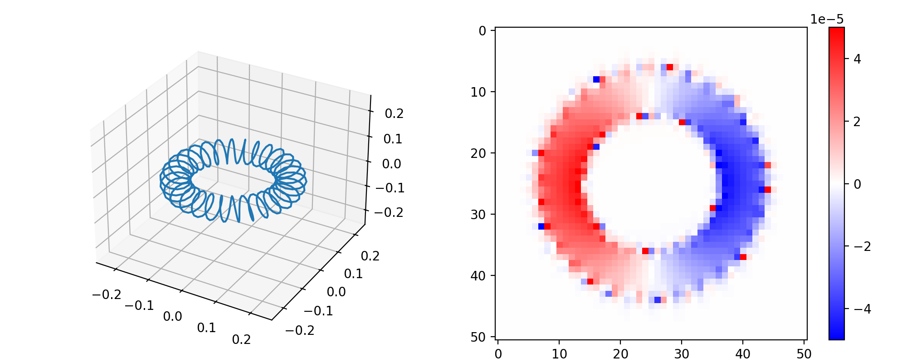

# PyBiotSavart

## Overview

PyBiotSavart is a Python library designed to simulate and visualize magnetic fields generated by various coil configurations using the Biot-Savart law. It provides an easy-to-use interface for calculating magnetic fields and visualizing them in 3D space.

## Features

- **Magnetic Field Calculation**: Compute magnetic fields for different coil geometries and currents using the Biot-Savart law.
- **Visualization**: Visualize magnetic field components in 2D slices and 3D plots.
- **Flexible Coil Configurations**: Supports circular, spiral, helical, and toroidal coil geometries.

## Requirements

- Python 3.6 or higher
- `numpy` for numerical computations
- `einops` for tensor rearrangement
- `matplotlib` for plotting

## Installation

To use PyBiotSavart, clone the repository and ensure the required dependencies are installed.

```bash
git clone https://github.com/your-repo/PyBiotSavart.git
cd PyBiotSavart
pip install -r requirements.txt
```

## Usage

Example: Circular Coil in the XY Plane

```python
import numpy as np
from PyBiotSavart import BiotSavart
from einops import rearrange
import matplotlib.pyplot as plt

# Define coil geometry
coil = np.zeros((200, 3))
coil[:, 2] = 0
coil[:, 0], coil[:, 1] = np.cos(np.linspace(0, 8 * np.pi, coil.shape[0], endpoint=False)) * 6e-2, \
                         np.sin(np.linspace(0, 8 * np.pi, coil.shape[0], endpoint=False)) * 6e-2

# Define current
current = 1

# Define mesh grid
xmin, xmax, nx = -25e-2, 25e-2, 51
ymin, ymax, ny = -25e-2, 25e-2, 51
zmin, zmax, nz = -25e-2, 25e-2, 51
x = np.linspace(xmin, xmax, nx, endpoint=True)
y = np.linspace(ymin, ymax, ny, endpoint=True)
z = np.linspace(zmin, zmax, nz, endpoint=True)
xx, yy, zz = np.meshgrid(x, y, z, indexing='ij')
mesh_grid = np.stack([xx, yy, zz], axis=-1)
vectorized_grid = rearrange(mesh_grid, "x y z p -> (x y z) p")

# Compute magnetic field
B = BiotSavart(coil, current, vectorized_grid)
mesh_B = rearrange(B, "(x y z) p -> x y z p", x=nx, y=ny, z=nz)

# Visualization
plt.figure(figsize=(10, 4))
ax1 = plt.subplot(1, 2, 1, projection="3d")
ax1.plot3D(coil[:, 0], coil[:, 1], coil[:, 2])
ax2 = plt.subplot(1, 2, 2)
im2 = ax2.imshow(mesh_B[:, :, 24, 2], cmap="bwr")
im2.set_clim(-5e-5, 5e-5)
plt.colorbar(im2, ax=ax2)
plt.show()
```
## Examples
The repository includes a Jupyter Notebook ([demo.ipynb](./demo.ipynb)) that demonstrates the following:

1. Circular Coil

2. Spiral Coil with Varying Radius

3. Helical Coil

4. Helical Coil with Varying Radius

5. Toroidal Coil with Sinusoidal Perturbation


Run the notebook to explore these examples and visualize the results.

## License

This project is licensed under the MIT License. See the LICENSE file for details.